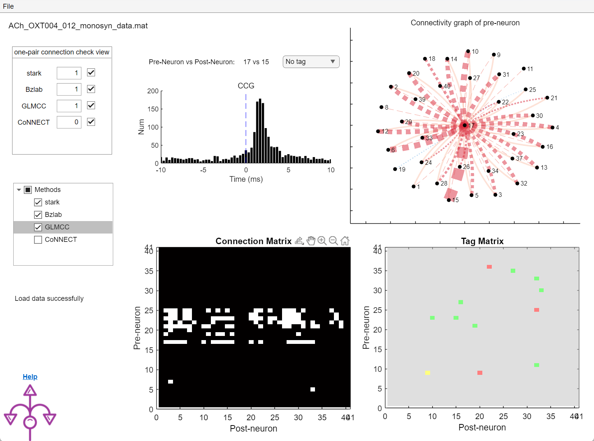

<p align="center">
    
</p>


# Neural_Monosynaptic_Connection_GUI
Neural_Monosynaptic_Connection_GUI is a interface app for neuroscientist to explore neural mono-syneptic connection of a pair of neurons, which is based on spike train.

This GUI integrate 4 methods for detecting mono-syneptic connection.

<p align="center">
    
</p>


## Quick Start
### 1. Installing package and add the colormap path 
```matlab
addpath('./colormap_CD-master/colormap_CD-master')
addpath('./CCH-deconvolution-main')
```
### 2. Run GUI and Load data 
run *MonoSynapticConnection_APP_exported.m* file to open the gui

by pressing the button of *file* and find the *load data*. There is a example data: *ACh_OXT004_012_monosyn_data.mat*, which can be used to quick start.

The data structure can be described as following:
- **CCG**: Contains the cross-correlogram data showing temporal relationships between neurons
- **tagmap**: Stores the tag information for neuron connections (e.g., good, weak, bad)
- **connection_matrix**: Matrix containing connection data
  - **GLMCCMatrix**: Connection matrix for the GLMCC method
  - **CoNNECTMatrix**: Connection matrix for the CoNNECT method
  - **starkMatrix**: Connection matrix for the Stark method
  - **BzlabMatrix**: Connection matrix for the Bzlab method
- **weight_matrix**: Matrix containing the weight of connections between neurons
  - **GLMCCMatrix**: Weight matrix for the GLMCC method
  - **CoNNECTMatrix**: Weight matrix for the CoNNECT method
  - **starkMatrix**: Weight matrix for the Stark method
  - **BzlabMatrix**: Weight matrix for the Bzlab method

### 3. Check connectivity

### 4. Save data
Sometimes, a bunch of neurons have been tagged (e.g., good, weak, bad). The tagged map can be saved and re-loaded the saved data future. 

## Computation and Praparing data of Monosyneptic connetion 
### Step 1 Get result by CoNNECT and GLMCC in python
The four methods are based on different lauguages. For CoNNECT and GLMCC algorithm, the computations completed in python. So you'd firstly install seperated environments for them and run the script to get result, respectively.

#### CoNNECT

Install cython and tensorflow at your PC if you have not done before. After installation, run the script `estimate.py`.
- Requirements:
  - cython (version 0.29.6.)
  - tensorflow (version 1.13.1.)
- Run setup.py
```python
$ cd modules
$ python setup.py build_ext -i
```
- Run file `./CoNNECT-master/estimate.py` to generate result of CoNNECT. The data was saved into `./detection_result/result_CoNNECT.csv`

#### GLMCC

Install cython and tensorflow at your PC if you have not done before. After installation, run the script `estimate.py`.
- Requirements:
  - numpy 
  - scipy
  - matplotlib
  - multiprocessing
- Run file `./GLMCC-master/Est_Data.py` to generate result of GLMCC. The data was saved into `./detection_result/result_GLMCC.csv`

### Step 2 Get result by stark's and buzsaki's lab, and generate data available for gui in matlab
- Run file `generate_GUI_data.m` to generate data for gui. The data was saved into `./ACh_OXT004_012_monosyn_data.mat`

### Step 3 Run GUI and Load data 
run *MonoSynapticConnection_APP_exported.m* file to open the gui

## Integrated 4 Monosyneptic connetion detected methods in GUI:
### 1. Evan Stark lab
https://github.com/EranStarkLab/CCH-deconvolution

The CCH deconvolution algorithm described by Spivak et al. was designed to remove burst spiking artifacts from cross-correlation histograms (CCHs). The core algorithm is implemented by the MATLAB routine cchdeconv.m

### 2. Buzsaki lab
https://github.com/buzsakilab/buzcode/tree/master/analysis/monosynapticPairs

### 3. GLMCC
https://github.com/NII-Kobayashi/GLMCC

This program estimates interneuronal connections by fitting a generalized linear model (GLM) to spike cross-correlations 

### 4. CoNNECT

https://github.com/shigerushinomoto/CoNNECT/tree/master

Convolutional Neural Network for Estimating synaptic Connectivity from spike Trains.
 
###
- Evan Stark lab - https://github.com/EranStarkLab/CCH-deconvolution
- Buzsaki lab - https://github.com/buzsakilab/buzcode/tree/master/analysis/monosynapticPairs
- GLMCC - https://github.com/NII-Kobayashi/GLMCC
- CoNNECT - https://github.com/shigerushinomoto/CoNNECT/tree/master

### Matrix
- Evan Stark lab 
  - Connection Matrix: act/sil
  - Weight Matrix: eSTG
- Buzsaki lab
  - Connection Matrix
- GLMCC
  - Connection Matrix: |Weight Matrix| > 0
  - Weight Matrix
- CoNNECT
  - Connection Matrix: |Weight Matrix| > 0
  - Weight Matrix
