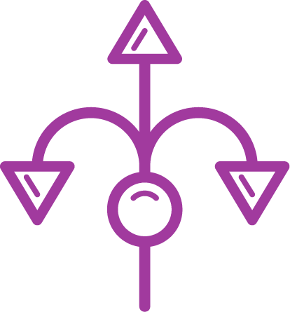

<p align="center">
    
</p>


# Neural_Monosynaptic_Connection_GUI
Neural_Monosynaptic_Connection_GUI is a interface app for neuroscientist to explore neural mono-syneptic connection of a pair of neurons, which is based on spike train.

This GUI integrate 4 methods for detecting mono-syneptic connection.

<p align="center">
    
</p>

## How to use Mono GUI
### 1. Installing package and add the colormap path 
```matlab
addpath('./colormap_CD-master\colormap_CD-master')
```
### 2. Load data 
by pressing the button of *file* and find the *load data*. There is a example data: *ACh_OXT004_012_monosyn_data.mat*, which can be used to quick start.

The data structure can be described as following:
- **CCG**: Contains the cross-correlogram data showing temporal relationships between neurons
- **tagmap**: Stores the tag information for neuron connections (e.g., good, weak, bad)
- **connection_matrix**: Matrix containing connection data
  - **GLMCCMatrix**: Connection matrix for the GLMCC method
  - **CoNNECTMatrix**: Connection matrix for the CoNNECT method
  - **starkMatrix**: Connection matrix for the Stark method
  - **BzlabMatrix**: Connection matrix for the Bzlab method
- **weight_matrix**: Matrix containing the weight of connections between neurons
  - **GLMCCMatrix**: Weight matrix for the GLMCC method
  - **CoNNECTMatrix**: Weight matrix for the CoNNECT method
  - **starkMatrix**: Weight matrix for the Stark method
  - **BzlabMatrix**: Weight matrix for the Bzlab method

### 3. Check connectivity

### 4. Save data
Sometimes, a bunch of neurons have been tagged (e.g., good, weak, bad). The tagged map can be saved and re-loaded the saved data future. 

## Monosyneptic connetion detected methods
- Evan Stark lab - https://github.com/EranStarkLab/CCH-deconvolution
- Buzsaki lab - https://github.com/buzsakilab/buzcode/tree/master/analysis/monosynapticPairs
- GLMCC - https://github.com/NII-Kobayashi/GLMCC
- CoNNECT - https://github.com/shigerushinomoto/CoNNECT/tree/master

## Matrix
- Evan Stark lab 
  - Connection Matrix: act/sil
  - Weight Matrix: eSTG
- Buzsaki lab
  - Connection Matrix
- GLMCC
  - Connection Matrix: |Weight Matrix| > 0
  - Weight Matrix
- CoNNECT
  - Connection Matrix: |Weight Matrix| > 0
  - Weight Matrix
